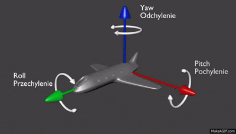

# Attention Monitor

## Algorithm Explanation
This project focuses on detecting yaw, pitch, and iris movements. The detection algorithms leverage deep learning techniques to analyze facial landmarks and compute the head pose from the input images. The yaw and pitch angles are calculated using vector math based on the detected points on the face, while iris detection involves identifying the location and position of the eyes using convolutional neural networks.

## Demo GIF


## Demo Video
You can view the demo video [here](https://drive.google.com/your-video-link).

## Detailed Architecture
The architecture consists of several key components:
- **Input Layer**: Captures the video feed.
- **Preprocessing Module**: Normalizes and resizes frames before analysis.
- **Detection Module**: Utilizes pre-trained models for detecting yaw, pitch, and iris.
- **Output Layer**: Displays the results overlay on the video feed.

## Installation
1. Clone the repository:
   ```bash
   git clone https://github.com/Shu6136713/Attention_Monitor.git
   cd Attention_Monitor
   ```
2. Install the necessary requirements:
   ```bash
   pip install -r requirements.txt
   ```

## How to Run
To run the application, execute:
```bash
python main.py
```
Ensure your webcam is connected.

## Configuration Options
You can customize the following options in the `config.json` file:
- `threshold`: Sensitivity of the detection (default: 0.5)
- `model_path`: Path to the trained model (default: `models/face_model.h5`)

## Future Improvements
- Enhance the model's accuracy with more training data.
- Optimize real-time processing performance.
- Add support for different environments such as low light.

## Author
Created by Shu6136713